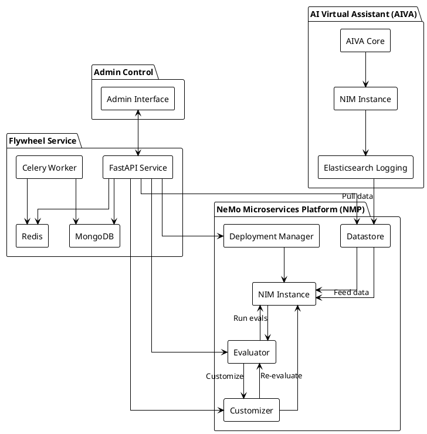
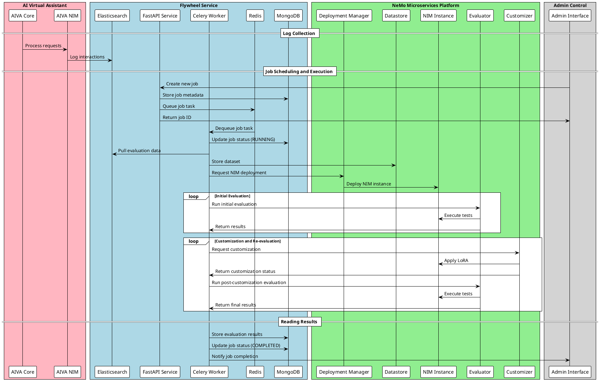

# Data Flywheel Blueprint Architecture

## Overview
The Data Flywheel Blueprint is a comprehensive system designed to automate and optimize the evaluation and fine-tuning of Large Language Models (LLMs) through a continuous feedback loop. This document outlines the core architectural components and their interactions.

## System Architecture Diagram



## System Interaction Flow



## Implementation Details

### Deployment
- NeMo microservices is deployed via Helm chart to an existing Kubernetes cluster
- AIVA and Flywheel Service are deployed separately from NeMo microservices
- Elasticsearch and MongoDB are managed services

### Development Focus
The Flywheel Service represents the primary development effort for this blueprint:
- All other components (NeMo microservices, AIVA, Elasticsearch, MongoDB) are existing services
- The Flywheel Service must be built from scratch
- Key components to implement:
  - FastAPI REST interface
  - Celery task management
  - Redis queue integration
  - MongoDB state management
  - NeMo microservices service integration

### Job Configuration
When scheduling a job, the following parameters are available:
```json
{
    "client_id": "string (required)",
    "workload_id": "string (required)",
    "job_type": "llm_job | embedding_job (optional, default: llm_job)",
    "config_name": "string (optional)",
    "data_split_config": {
        "eval_size": 100,
        "val_ratio": 0.1,
        "min_total_records": 50,
        "limit": 1000
    }
}
```
- `client_id`: Unique identifier for the client organization
- `workload_id`: Identifier for the specific workload
- `job_type`: Type of job to run (LLM fine-tuning or embedding fine-tuning)
- `config_name`: Optional name of custom configuration to use
- `data_split_config`: Optional configuration for data splitting and processing

### Elasticsearch Logging Schema
All interactions are logged to Elasticsearch for data collection and analysis. The logging system captures:

- Request and response data from AI interactions
- Timestamp information with millisecond precision
- Client and workload identifiers for data organization
- Structured data for downstream processing

Key requirements:
- All logged interactions include client_id and workload_id for proper data segmentation
- Timestamps use Unix format with millisecond precision
- Data is structured to support automated dataset creation
- Logging integrates with the RecordExporter for data retrieval

### Job Configuration Schema
Job scheduling is configured using the following Pydantic model:

```python
from typing import Literal
from pydantic import BaseModel, Field
from src.config import DataSplitConfig

class JobRequest(BaseModel):
    """Request model for creating a new job."""
    
    workload_id: str = Field(
        ...,
        description="The unique identifier of the workload to process",
        examples=["workload_123"],
    )
    
    client_id: str = Field(
        ...,
        description="The unique identifier of the client to process",
        examples=["client_123"],
    )
    
    data_split_config: DataSplitConfig | None = Field(
        None,
        description="Optional configuration for data splitting. If not provided, default config will be used.",
    )
    
    job_type: Literal["llm_job", "embedding_job"] = Field(
        default="llm_job",
        description="Type of job to run - either 'llm_job' or 'embedding_job'",
        examples=["llm_job", "embedding_job"],
    )
    
    config_name: str | None = Field(
        None,
        description="Optional name of the configuration to use for this job. If not provided, default config will be used.",
        examples=["my-llm-config", "production-config"],
    )
```

Key features:
- Required fields: `workload_id` and `client_id`
- Optional data split configuration for custom data processing
- Job type selection between LLM and embedding workflows
- Optional configuration name for using custom job configurations
- Field validation and examples for API documentation

## Core Components

### 1. NeMo microservices

- Overview of NeMo microservices's role in the system
- Key microservices:
  - Deployment Manager: Manages NIM instances
  - Evaluator: Runs evaluations against NIMs
  - Customizer: Creates LoRAs for supported NIMs
  - Datastore: Stores and manages datasets
- Integration points with other components

### 2. AI Virtual Assistant (AIVA)
- Overview of AIVA's role
- NIM management and configuration
- Elasticsearch logging integration
- Interaction with the Flywheel Service

### 3. Flywheel Service
- REST API implementation (FastAPI)
- Job scheduling and management (Celery)
- Data persistence:
  - Redis queue for workloads
  - MongoDB for application state
- Workflow components:
  - Dataset creation from Elasticsearch
  - NIM deployment and management
  - Evaluation pipeline
  - Customization process
- Supported NIM configurations (~20 NIMs)

### 4. Admin Control Component
- Job scheduling interface
- Results monitoring and analysis
- NIM configuration management
- AIVA modification controls

## System Workflow
1. Data Collection and Processing
2. NIM Evaluation Pipeline
3. Customization and Fine-tuning
4. Results Analysis and Decision Making
5. AIVA Integration

## Data Flow
- Elasticsearch to Datastore
- Datastore to NIM
- NIM to Evaluator
- Evaluator to Customizer
- Results to Admin Control

## Technical Stack
- FastAPI for REST API
- Celery for task scheduling
- Redis for queue management
- MongoDB for state persistence
- Elasticsearch for logging
- NeMo microservices integration

## Security Considerations
- API authentication and authorization
- Data access controls
- Service-to-service communication security

## Scalability and Performance
- Horizontal scaling strategies
- Load balancing considerations
- Performance monitoring and optimization

## Future Considerations
- Additional NIM support
- Enhanced customization capabilities
- Extended evaluation metrics
- Integration with other AI platforms
