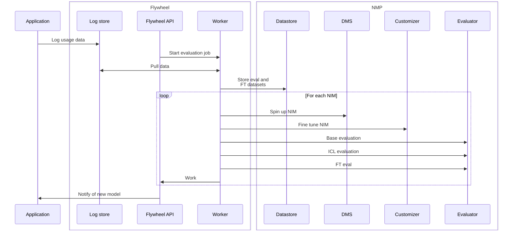
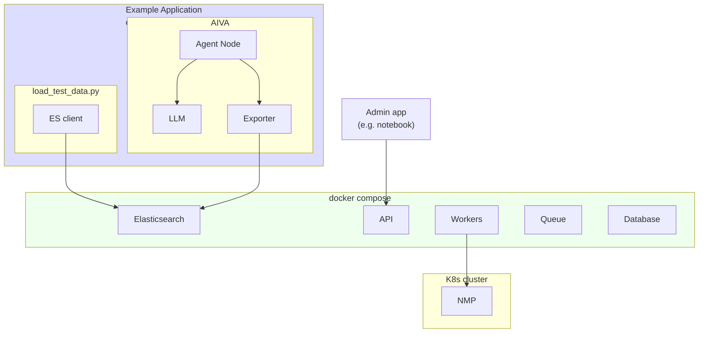

# Flywheel Architecture Overview

```mermaid
sequenceDiagram
    participant App as Application

    box Flywheel
        participant ES as Log store
        participant API as Flywheel API
        participant Worker as Worker
    end

    box NMP
        participant datastore as Datastore
        participant dms as DMS
        participant customizer as Customizer
        participant eval as Evaluator
    end

    App->>ES: Log usage data
    API->>Worker: Start evaluation job
    Worker <<->> ES: Pull data
    Worker ->> datastore: Store eval and<br>FT datasets

    loop For each NIM
        Worker ->> dms: Spin up NIM
        Worker ->> customizer: Fine tune NIM

        Worker->> eval: Base evaluation
        Worker->> eval: ICL evaluation
        Worker->> eval: FT eval

        Worker->>API: Work
    end
    API->>App: Notify of new model
```

## Deployment Architecture

```mermaid
flowchart TD

    subgraph ex["Example Application<br>e.g. AIVA"]
        subgraph AIVA
            agent["Agent Node"]
            LLM
            Exporter

            agent --> LLM
            agent --> Exporter
        end

        subgraph loader_script["load_test_data.py"]
            script_es["ES client"]
        end
    end

    style ex fill:#ddddff

    script_es --> log_store
    Exporter --> log_store

    subgraph Blueprint["docker compose"]
        api["API"]
        workers["Workers"]
        log_store["Elasticsearch"]
        queue["Queue"]
        database["Database"]
    end

    subgraph k8s["K8s cluster"]
        nmp["NMP"]
    end

    workers --> nmp

    style Blueprint fill:#efe

    admin["Admin app<br>(e.g. notebook)"] --> api
```