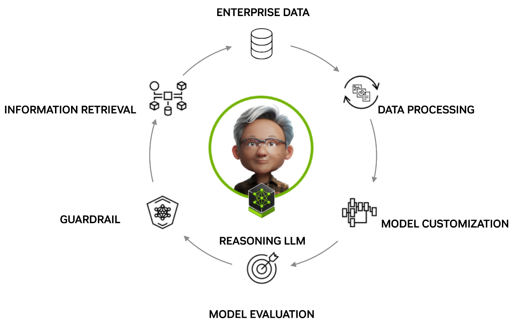

# NVIDIA Data Flywheel Foundational Blueprint Notebooks

## Introduction

A data flywheel creates a self-reinforcing loop where user interactions continuously enhance the AI application. As users engage, their input helps identify more efficient models (or NIMs) that achieve comparable accuracy, reducing the total cost of ownership. Additionally, these interactions can help improve or maintain model accuracy, leading to better responses and contribute to the ongoing generation of higher-quality data.



Key steps in a data flywheel include logging user interactions, processing the data, customizing and evaluating candidate models, adding guardrails, and integrating them with external knowledge bases for question answering.

## How it Works

The Data Flywheel Blueprint provides a unified API (the Orchestrator) that abstracts away the complexity of directly managing [NVIDIA NeMo Microservices](https://docs.nvidia.com/nemo/microservices/latest/about/index.html). As a user, you interact only with the Data Flywheel Orchestrator API to:

- Launch new flywheel jobs (for fine-tuning, evaluation, and deployment of models)
- Monitor job progress and results
- Access evaluation metrics and customization status

**What happens under the hood:**  

When you submit a job via the Orchestrator API, the system:
- Retrieves and processes your data (e.g., from Elasticsearch)
- Creates and uploads datasets for training, evaluation, and validation
- Deploys and manages candidate models (NIMs) on the NeMo platform
- Runs evaluations (including LLM-as-a-judge if configured)
- Handles model customization and tracks progress
- Aggregates results and exposes them through the same API

All direct communication with the NeMo Microservices platform (model deployment, evaluation, customization, etc.) is handled by the orchestrator's backend services. This means you do not need to interact with NeMo APIs or infrastructure directly—the orchestrator manages the full workflow for you.

## Notebooks

Check out the following example notebooks to learn how to optimize LLMs using a data flywheel.

- [Discover More Cost-Efficient AI Customer Service Agents](./aiva-data-flywheel-tutorial.ipynb): Use logs and tool-calling data to fine-tune and evaluate a more cost efficient model.

## Prerequisites

### Deploy NeMo Microservices

To follow this tutorial, you will need at least six A100/H100-80GB NVIDIA GPUs, which will be allocated as follows:

- **Fine-tuning:** At least one GPU for fine-tuning the `meta/llama-3.2-1B-instruct`, `meta/llama-3.2-3B-instruct` or `meta/llama-3.1-8B-instruct` model.
- **Inference:** At least one GPU for deploying the corresponding NIM for evaluation.
- **LLM-as-a-judge evaluation:** Four GPUs to deploy the `meta/llama-3.3-70B-instruct` NIM to serve as a judge LLM for evaluation tool calling responses.

Refer to the [platform prerequisites and installation guide](https://docs.nvidia.com/nemo/microservices/latest/get-started/platform-prereq.html) to deploy NeMo Microservices.

> **Note**
>
> At the time of deploying the microservices helm chart, you will need to update `demo-values.yaml` to include the models that should be part of the search space. Make this configuration in the `customizer` settings -
>

```yaml
customizer:
  enabled: true
  modelsStorage:
    storageClassName: standard
  customizerConfig:
    models:
      meta/llama-3.2-1b-instruct:
        enabled: true
      meta/llama-3.2-3b-instruct:
        enabled: true
      meta/llama-3.1-8b-instruct:
        enabled: true
        model_path: llama-3_1-8b-instruct
        training_options:
        - finetuning_type: lora
          num_gpus: 1
          training_type: sft
    training:
      pvc:
        storageClass: "standard"
        volumeAccessMode: "ReadWriteOnce"
```

Scale down the default deployment of `meta/llama-3.1-8b-instruct` NIM. Flywheel orchestrator will do all the necessary deployments on the user's behalf.

```bash
export NEMO_URL="http://nemo.test"

curl -X DELETE "$NEMO_URL/v1/deployment/model-deployments/meta/llama-3.1-8b-instruct"
```

### Deploy Data Flywheel Blueprint

1. Clone the blueprint repository:

   ```sh
   git clone git@github.com:NVIDIA-AI-Blueprints/data-flywheel.git

   cd data-flywheel
   ```

2. Install dependencies using [uv](https://docs.astral.sh/uv/getting-started/installation/):

   ```sh
   uv sync --dev
   ```

3. Configure Models for the Flywheel Orchestrator

    In [config/config.yaml](../config/config.yaml), update the `nim` configuration to enable the following models for customization by flywheel orchestrator: 
    * `meta/llama-3.2-1b-instruct`
    * `meta/llama-3.2-3b-instruct`
    * `meta/llama-3.1-8b-instruct`

    ```yaml
    nims:
      - model_name: "meta/llama-3.2-1b-instruct"
        context_length: 8192
        gpus: 1
        pvc_size: 25Gi
        tag: "1.8.3"
        customization_enabled: true


      - model_name: "meta/llama-3.2-3b-instruct"  
        context_length: 32768  
        gpus: 1  
        pvc_size: 25Gi  
        tag: "1.8.3"  
        customization_enabled: true


      - model_name: "meta/llama-3.1-8b-instruct"  
        context_length: 32768  
        gpus: 1  
        pvc_size: 25Gi  
        tag: "1.8.3"  
        customization_enabled: true
    ```


4. Spin up the Data Flywheel Orchestrator:

   ```sh
   ./scripts/run.sh
   ```

Once the services are all up, continue with the notebook.

### Access the Tutorial

1. Launch Jupyter Lab to begin working with the provided tutorial.

   ```bash
   uv run --with jupyter jupyter lab --ip=0.0.0.0
   ```

2. Navigate to the [notebook](#notebooks).
